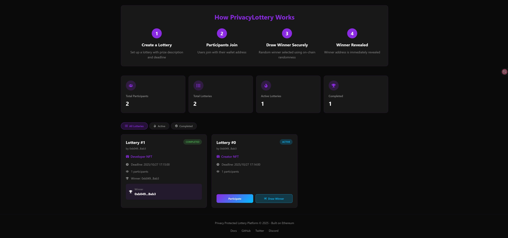

# PrivacyLottery

A privacy-first decentralized lottery platform built on Ethereum, allowing anyone to create and participate in lotteries with complete fairness and transparency. Using on-chain randomness and wallet-based participation, PrivacyLottery ensures secure, anonymous, and verifiable lottery operations.

## Live Demo

Try the live application: [https://privacy-lottery.netlify.app/](https://privacy-lottery.netlify.app/)




## Project Background

Traditional online lotteries often face problems of transparency, fairness, and privacy:

- Lack of trust: Users cannot be sure if the lottery is fair
- Identity exposure: Participants’ wallet addresses or personal details may be linked
- Centralized risks: Operators may manipulate results
- Limited verification: Results cannot always be independently verified

PrivacyLottery solves these challenges with a blockchain-based lottery system where:

- All actions (creation, participation, drawing winners) are executed via smart contracts
- Winners are selected using verifiable on-chain randomness
- Participant privacy is protected — only necessary information is revealed
- The entire process is transparent, immutable, and trustless

## Features

### Core Functionality

- Lottery Creation: Set up a new lottery with prize description and deadline
- Participation: Join any active lottery using your Ethereum wallet
- Fair Draw: Random winners selected through on-chain randomness
- Result Transparency: Winners are revealed immediately after the draw
- Real-time Dashboard: View active, completed, and total lotteries with stats

### Privacy & Fairness

- Anonymous Participation: Users join without revealing sensitive personal data
- Verifiable Randomness: Ensures fair and unbiased winner selection
- Immutable Records: Lottery history cannot be altered once created
- Wallet Authentication: Secure participation through Ethereum wallets

## Architecture

### Smart Contracts

Lottery.sol (deployed on Ethereum)

- Manages lottery creation, participation, and winner selection
- Ensures deadlines and rules are enforced automatically
- Handles participant tracking and prize distribution
- Provides transparent lottery state for all users

### Frontend Application

- React + TypeScript: Interactive and responsive UI
- Ethers.js: Wallet integration and blockchain interaction
- Modern UI/UX: Dashboard with statistics, tabs, and animations
- Wallet Management: Connect, switch, and disconnect seamlessly
- Real-time Updates: Fetches lottery states directly from blockchain

## Technology Stack

### Blockchain

- Solidity ^0.8.24: Smart contract development
- OpenZeppelin: Secure libraries for contract design
- Hardhat: Development, testing, and deployment framework
- Ethereum Sepolia Testnet: Current deployment network

### Frontend

- React 18 + TypeScript: Modern frontend framework
- Ethers.js: Ethereum blockchain interaction
- React Icons: Icon library for UI/UX
- Tailwind + CSS: Styling and layout
- Vercel: Frontend deployment platform

## Installation

### Prerequisites

- Node.js 18+
- npm / yarn / pnpm package manager
- Ethereum wallet (MetaMask, WalletConnect, etc.)

### Setup

```bash
# Clone the repository
git clone https://github.com/cloud-until/privacy-lottery.git
cd privacy-lottery

# Install dependencies
npm install

# Compile contracts
npx hardhat compile

# Deploy to network (configure hardhat.config.js first)
npx hardhat run deploy/deploy.ts --network sepolia

# Start the development server
cd frontend

# Install dependencies
npm install

# Run
npm run dev   
```

## Usage

- Connect Wallet: Click the "Connect Wallet" button and select your wallet
- Create Lottery: Define prize description and deadline, then confirm on-chain
- Participate: Join an active lottery with one click
- Draw Winner: Lottery creators can trigger random winner selection after the deadline
- View Results: See winner information once the lottery is completed

## Security Features

- On-chain randomness ensures unbiased winner selection
- Immutable records guarantee lottery integrity
- No centralized authority can manipulate results
- Wallet-based access secures participation

## Future Enhancements

- Multi-chain deployment for broader accessibility
- Prize distribution with ERC20 tokens or NFTs
- Advanced lottery types (raffles, multi-winner draws)
- Mobile-friendly optimized interface
- DAO governance for community-driven improvements

Built with ❤️ for a fair and private lottery experience on Ethereum
